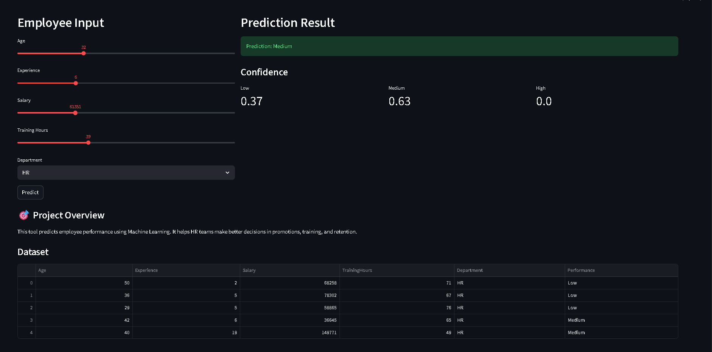
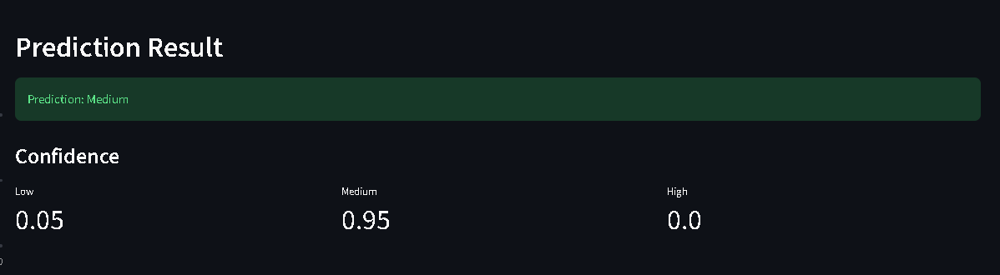
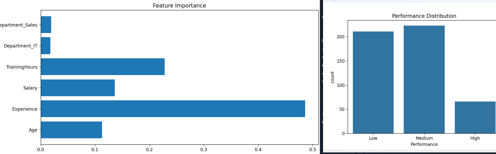

# 💼 Employee Performance Predictor

## 📌 Overview
The **Employee Performance Predictor** is a Machine Learning project designed to predict employee performance based on attributes such as experience, salary, training hours, and department.

This project simulates a real-world **HR analytics system** and helps organizations make **data-driven decisions**.

---

## 🎯 Business Problem
Organizations often struggle to:

- Identify high-performing employees  
- Detect low performers early  
- Plan training and development  
- Make promotion decisions  

This project solves these problems using Machine Learning.

---

## 🧠 Solution Approach
- Generated synthetic HR dataset  
- Performed data preprocessing and feature engineering  
- Trained a Random Forest classification model  
- Built an interactive Streamlit dashboard  
- Provided real-time predictions with confidence scores  

---

## ⚙️ Tech Stack

| Category         | Tools Used |
|----------------|-----------|
| Language        | Python |
| Data Handling   | Pandas, NumPy |
| Visualization   | Matplotlib, Seaborn |
| Machine Learning| Scikit-learn |
| Deployment UI   | Streamlit |
| Model Storage   | Joblib |
| Version Control | Git, GitHub |

---

## 🚀 Features
- ✅ Employee performance prediction (Low / Medium / High)  
- ✅ Real-time user input via dashboard  
- ✅ Confidence scores for predictions  
- ✅ Data visualization (graphs & charts)  
- ✅ Feature importance analysis  
- ✅ HR insights generation  

---

## 📊 Machine Learning Model
- Model Used: Random Forest Classifier  
- Problem Type: Classification  
- Target Variable: Employee Performance  
- Accuracy: ~80% – 90% (after adding realistic noise)  

---

## 🏗️ Project Architecture

Data Generation → Preprocessing → Model Training → Evaluation → Prediction → Dashboard


---

## 📂 Folder Structure

```
Employee-Performance-Predictor/
│
├── data/
│   └── employee_data.csv
│
├── models/
│   └── performance_model.pkl
│
├── outputs/
│   ├── performance_distribution.png
│   ├── confusion_matrix.png
│   └── feature_importance.png
│
├── images/
│   ├── dashboard.png
│   ├── prediction.png
│   └── graph.png
│
├── src/
│   ├── data_generator.py
│   ├── preprocessing.py
│   ├── model.py
│   ├── evaluate.py
│   └── visualize.py
│
├── app.py
├── main.py
├── requirements.txt
└── README.md
```

---

## ▶️ How to Run Locally

### Step 1: Clone Repository

git clone https://github.com/Vayu-143/employee-performance-predictor-ml

cd employee-performance-predictor-ml

### Step 2: Install Dependencies

pip install -r requirements.txt


### Step 3: Train Model

python main.py


### Step 4: Run Dashboard

streamlit run app.py


---

## 🌐 Live Demo
👉 https://employee-performance-predictor-ml-uhtm3bkaktgaqmtgdfmzqg.streamlit.app/

---

## 📸 Screenshots

### 🔹 Dashboard


### 🔹 Prediction Result


### 🔹 Graphs & Insights


---

## 📈 Key Insights
- Employees with higher training hours tend to perform better  
- Experience plays a major role in performance prediction  
- Salary alone is not a strong indicator of performance  

---

## 🧪 Simulation Details
Since real HR data is not publicly available:

- Synthetic dataset was generated  
- Performance logic includes randomness for realism  
- Model simulates real-world HR decision systems  

---

## 💼 Business Impact
This system can help companies:

- Improve employee productivity  
- Optimize training programs  
- Reduce employee attrition  
- Make smarter HR decisions  

---

## 🎤 Interview Explanation

### 🔹 Short Version
> Built a machine learning system to predict employee performance and deployed it using Streamlit for real-time HR insights.

### 🔹 Technical Version
> Developed a Random Forest classification model using synthetic HR data, applied preprocessing and feature engineering, and deployed it with Streamlit for interactive predictions and visualization.

---

## 🚀 Future Improvements
- 🔹 Use real HR datasets  
- 🔹 Add employee attrition prediction  
- 🔹 Deploy on cloud (AWS / Render)  
- 🔹 Add authentication system  
- 🔹 Upgrade model to XGBoost / Deep Learning  

---

## 🐞 Troubleshooting

**Issue:** Module not found  
**Solution:**

pip install -r requirements.txt


**Issue:** Model not loading  
**Solution:**

python main.py


---

## 👨‍💻 Author

**Vayunandan Mishra**

- GitHub: https://github.com/Vayu-143  
- Project Repo: https://github.com/Vayu-143/employee-performance-predictor-ml  

---

## ⭐ If you like this project
Give it a ⭐ on GitHub!